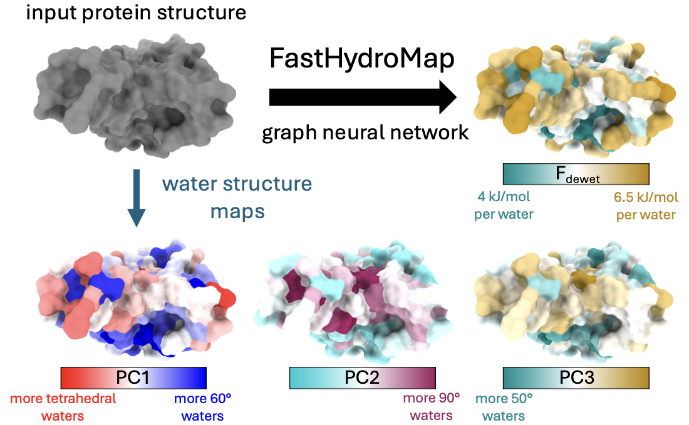
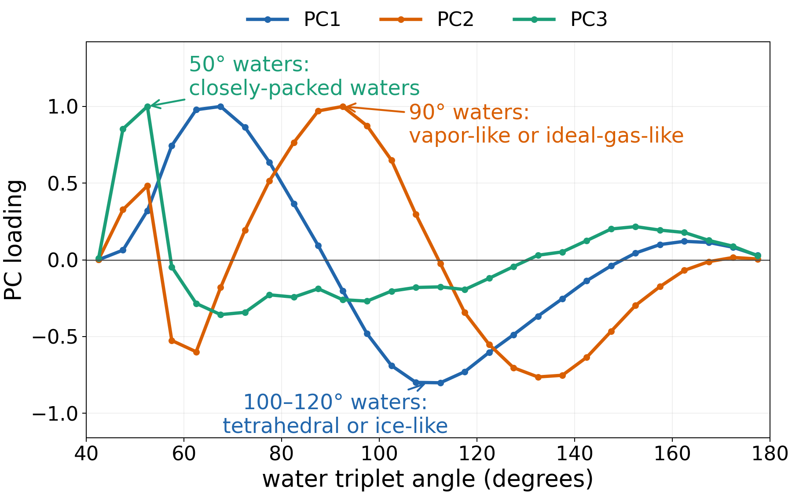

# FastHydroMap ChimeraX tutorial

FastHydroMap predicts a per-residue dewetting free energy (`Fdewet`) or one of
three learned water-structure components (`PC1`, `PC2`, and `PC3`) and maps the
result onto a ChimeraX structure.

The method is described in Lobo, Najafi, Shea, and Shell,
[*Context-Aware Hydrophobicity Modeling: HydroMap and FastHydroMap*](https://doi.org/10.64898/2026.06.07.730647).



## 1. Install

FastHydroMap requires ChimeraX 1.12 or newer. Install the bundle from
**Tools > More Tools...**, search for **FastHydroMap**, and click **Install**.
The equivalent ChimeraX command is:

```text
toolshed install FastHydroMap
```

The first prediction also needs a one-time installation of FastHydroMap and
PyTorch in an isolated environment managed by the bundle:

```text
fasthydromap install
```

Wait for the ChimeraX Log to report a
successful installation before continuing.

When installation finishes, the ChimeraX Log displays clickable example and
help commands. You can reopen the full command reference at any time with:

```text
help fasthydromap
```

## 2. Make Fdewet and water-structure maps

Open a protein, then make the default `Fdewet` map:

```text
open 1a1u
fasthydromap #1
```
where `#1` specifies the atoms to be colored. For example, `#2` would instead color the second loaded model, while `/A` would color just chain A.

To make water-structure maps:
```text
fasthydromap #1 quantity pc1
fasthydromap #1 quantity pc2
fasthydromap #1 quantity pc3
```
where PC1, PC2, and PC3 refer to different aspects of water structuring; see interpretation below.

`Fdewet` describes the thermodynamic cost of removing hydration water.

`PC1` tracks a tradeoff between icosahedral waters (60°) and tetrahedral or ice-like waters (100-120°);

`PC2` tracks vapor-like or ideal-gas-like water signature (90°) that are often seen near extended hydrophobic surfaces;

`PC3` tracks closely packed waters (50°) that are often seen near charged surfaces.

Changes in these hydration structures may help explain protein
function, including water-mediated stabilization, wetting or drying of pockets
and interfaces, and tightly coordinated hydration near polar or charged sites.

## 3. Why use dewetting free energy (Fdewet)?

Traditional sequence hydropathy scales assign one value to each amino-acid
identity. They are useful for sequence-level analysis, but they cannot describe
how the same residue changes when its solvent exposure, neighboring chemistry,
surface curvature, or conformation changes.

`Fdewet` instead measures the thermodynamic cost of removing hydration water
from a local surface. A lower value means that water is easier to remove and the
surface is more hydrophobic; a higher value means that water is retained more
strongly and the surface is more hydrophilic. FastHydroMap predicts this
context-dependent quantity directly from protein structure, making it useful for
examining binding interfaces, pockets, conformational changes, folding, and
aggregation without running the expensive dewetting simulations directly.

See [Najafi, *et al.*](https://doi.org/10.1021/acs.jpcb.4c06399), [Lobo, *et al.*](https://doi.org/10.1021/acs.jpcb.5c02360), and papers from [Amish Patel](https://patelgroup.seas.upenn.edu/publications/) for further discussion of dewetting free energy.

## 4. Interpret the water-structure maps

PC1, PC2, and PC3 are signed projections of the local hydration-water triplet-
angle distribution relative to bulk water. These principal component projections are based on the water-structure analysis of
[Robinson Brown *et al.*](https://doi.org/10.1021/acs.jpcb.3c00826), so the
signs have the following interpretations:



| Map | Negative values | Positive values |
| --- | --- | --- |
| **PC1** | More tetrahedral, water-like ordering (~100-120°) associated with hydrophobic surfaces. | A shift toward more simple-fluid/icosahedral motifs (~60°) and away from tetrahedral ordering. |
| **PC2** | Enrichment of roughly 130–150° triplet angles and depletion around 90°. | Enrichment around 90° and depletion around 130–150°; a more disordered signature associated with water next to large, smooth hydrophobic interfaces. |
| **PC3** | Depletion of the 40–50° high-coordination signature. | Enrichment of 40–50°, highly coordinated waters seen near polar and charged sites; this generally accompanies higher `Fdewet` and greater hydrophilicity. |


## 5. Change the scale or display

Set the two palette extremes with `range low,high`:

```text
fasthydromap #1 range 4,7
```

Predict another quantity or supply a ChimeraX palette:

```text
fasthydromap #1 quantity pc2 palette blue:white:red range -2,8
fasthydromap #1 quantity pc3 palette ^lipophilicity range -2,2
```

The default display colors atoms, cartoon, and molecular surface and is a good
starting point. Cosmetic options such as `target` and `showAtoms` can change
which representations are colored or shown. Use `help fasthydromap` for those
options. Use `color false` when you want to calculate and store the attribute
without recoloring the model.

## Notes

- FastHydroMap was trained on structured proteins and the 20 canonical
  amino-acid chemistries. Treat predictions for modified or non-canonical amino
  acids cautiously.
- Non-protein residues are not meaningfully modeled by FastHydroMap.
- Differences in histidine protonation states (HID vs HIE) are not meaningfully modeled. Charged histidine state (HIP) is not currently modeled, so be cautious about interpreting histidine hydrophobicity / water structure.
- We recommend using/altering [HydroMap](https://github.com/samlobe/HydroMap) to model hydrophobicity of noncanonical amino acids, specific histidine protonation states, or non-protein residues (e.g. DNA/RNA).
- The managed FastHydroMap installation is separate from the ChimeraX bundle.
  Removing or upgrading one does not automatically remove the other.
- Run `help fasthydromap` inside ChimeraX for the complete command reference.
